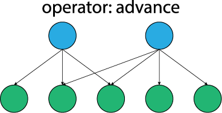
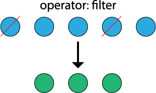
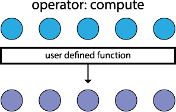

# Programming Model

This page describes the programming model we use in Gunrock.

Gunrock targets graph computations that are generally expressed as "iterative convergent processes". By "iterative," we mean operations that may require running a series of steps repeatedly; by "convergent," we mean that these iterations allow us to approach the correct answer and terminate when that answer is reached. Many graph-computation programming models target a similar goal.

Many of these programming models focus on sequencing steps of _computation_.  Gunrock differs from these programming models in its focus on _manipulating a data structure_. We call this data structure a _frontier_ of vertices or edges. **The frontier represents the subset of vertices or edges that is actively participating in the computation.** Gunrock operators input one or more frontiers and output one or more frontiers.

Generically, graph operations can often be expressed via a _push_ abstraction (graph elements "push" local private updates into a shared state) or a _pull_ abstraction (graph elements "pull" updates into their local private state) ([Besta et al. publication on push-vs.-pull, HPDC '17](https://htor.inf.ethz.ch/publications/index.php?pub=281)). Gunrock's programming model supports both of these abstractions. (For instance, Gunrock's direction-optimized Breadth-First Search (BFS) and PageRank (PR) supports both push and pull BFS phases. [Mini-Gunrock](https://github.com/gunrock/mini) supports pull-based BFS and PR.) Push-based approaches may or may not require synchronization (such as atomics) for correct operation; this depends on the primitive. Gunrock's idempotence optimization (within its BFS implementation) is an example of a push-based primitive that does not require atomics.

## Operators

In the current Gunrock release, we support **five** operators.

+ **Advance**: An _advance_ operator generates a new frontier from the current frontier by visiting the neighbors of the current frontier. A frontier can consist of either vertices or edges, and an advance step can input and output either kind of frontier. Advance is an irregularly-parallel operation for  two reasons: 1)~different vertices in a graph have different numbers of neighbors and 2)~vertices share neighbors. Thus a vertex in an input frontier map to multiple output items. An efficient advance is the most significant challenge of a GPU implementation.

+ **Filter**:  A _filter_ operator generates a new frontier from the current frontier by choosing a subset of the current frontier based on programmer-specified criteria. Each input item maps to zero or one output items.

  

+ **Compute**: A _compute_ operator defines an operation on all elements (vertices or edges) in its input frontier. Gunrock implements a compute operator using `ForAll()` and `ForEach()` parallel loops. However, a programmer-specified operation can also be implemented using C++ lambda functions within the traversal operators such as advance or filter. Gunrock performs these operation in parallel across all elements without regard to order.

+ **Segmented intersection**: A _segmented intersection_ operator takes two input node frontiers with the same length, or an input edge frontier, and generates both the number of total intersections and the intersected node IDs as the new frontier.

+ **Neighbor-Reduce**: A _neighbor-reduce_ operator uses the advance operator to visit the neighbor list of each item in the input frontier and performs a segmented reduction over the neighborhood (neighbor list) generated via the advance.
